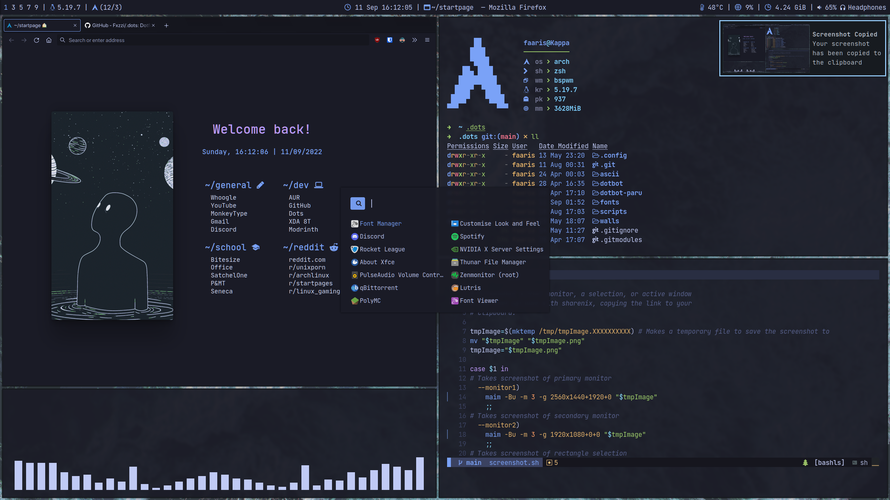

<h1 align="center">⚈ dots</h1>
<h4 align="center">by fxzzi.</h4>

<p align="center">
    <a href="https://github.com/fxzzi/.dots/stargazers"></a>
    <a href="https://github.com/fxzzi/.dots/network/members"></a>
    <a href="https://github.com/fxzzi/.dots/network/members"></a>
</p>
<p align="center">
  
</p>

## ✔️ Installation

```
$ git clone https://github.com/Fxzzi/.dots.git & ./.dots/install
```
This will create symlinks and overwrite files. It will also install all packages from needed.list. Please backup your current configs before installing!

## 🖥️ Wallpapers
These wallpapers were made with the work of [Catppuccin Factory!](https://github.com/FaarisAnsari/catppuccin-factory "catFactory on GitHub")

[walls folder](https://github.com/Fxzzi/.dots/tree/main/walls "walls folder") 

<details>
  <summary>👨‍💻 Dependencies</summary>
  
[bspwm](https://github.com/baskerville/bspwm "bspwm on GitHub")

[sxhkd](https://github.com/baskerville/sxhkd "sxhkd on GitHub")

[Kitty](https://github.com/kovidgoyal/kitty "Kitty on GitHub")

[Cava](https://github.com/karlstav/cava "Cava on GitHub")

[Polybar](https://github.com/polybar/polybar)

[picom-arian8j2](https://github.com/Arian8j2/picom "Arian8j2's fork of Picom on GitHub")

[rofi](https://github.com/davatorium/rofi "rofi on GitHub")

[xidlehook](https://github.com/jD91mZM2/xidlehook "xidlehook on github")

[bottom](https://github.com/ClementTsang/bottom "bottom on github")

[Dunst](https://github.com/dunst-project/dunst "Dunst on GitHub")

[i3-volume](https://github.com/hastinbe/i3-volume "i3-volume on GitHub")

[zsh](https://www.zsh.org/ "zsh")

</details>

<details>
  <summary>👩‍💻 Other Useful Tidbits</summary>
  
[OhMyZsh](https://github.com/ohmyzsh/ohmyzsh "OhMyZsh on GitHub")

[rsClock](https://github.com/valebes/rsClock "rsClock on GitHub")

[Librewolf](https://librewolf.net/ "librewolf")

</details>
